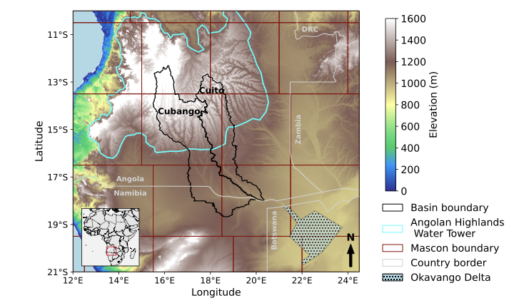

# Okavango Delta GRACE Analysis

This repository contains data and code associated with the article:

> **"Improved understanding of Okavango Delta inundation using GRACE-derived terrestrial water storage"** (2025), *Environmental Research: Water*.

The code here enables the reproduction of all figures presented in the publication, utilizing publicly available **GRACE (Gravity Recovery and Climate Experiment)** Terrestrial Water Storage (TWS) and **CHIRPS** precipitation data.

---

### Authors & Citation

| Role | Name(s) |
| :--- | :--- |
| **Article Authors** | Angela Jean Rigden, Brett Buzzanga, Mauro Lourenço, Nathaniel Robinson, Isabella Velicogna, and Stephan Woodborne |
| **Code Author** | Angela Jean Rigden |

---

## Contents

This repository is structured as follows:

* `Figure_1.ipynb`: **Jupyter Notebook** to generate **Figure 1**.
* `Figures_2-5.ipynb`: **Jupyter Notebook** to generate **Figures 2–5**.
* `example_data/`: Contains **example datasets** needed to reproduce the figures.
* `Figures/`: Stores **publication-quality figure files** (PDF format) generated by the notebooks.

---

## Data

### Example Data

The `example_data/` directory includes subsets of the following for figure reproduction:

* **GRACE TWS anomalies** for the Angola region (2002–2024).
* **CHIRPS v3 precipitation data** (1981–2024).
* Associated **geographic data** (shapefiles for basins, Angolan Highlands Water Tower) and **Digital Elevation Model (DEM)**.

### Full-Resolution Datasets

Full-resolution datasets can be accessed from the following public archives:

* **GRACE TWS:** [https://grace.jpl.nasa.gov/data/get-data/jpl_global_mascons/](https://grace.jpl.nasa.gov/data/get-data/jpl_global_mascons/)
* **CHIRPS v3:** [https://data.chc.ucsb.edu/products/CHIRP-v3.0/](https://data.chc.ucsb.edu/products/CHIRP-v3.0/)
* **HydroSHEDS (for DEM/Shapefiles):** [https://www.hydrosheds.org](https://www.hydrosheds.org)

---

## Requirements and Usage

### Software Requirements

* **Python 3.12+**
* **Required Packages:** `numpy`, `pandas`, `matplotlib`, `xarray`, `scipy`, `cartopy`, `netCDF4`, **`geopandas`**, **`rasterio`**, **`statsmodels`**, **`scikit-learn`**, **`pwlf`**

You can install the required Python packages using **pip**:

`pip install numpy pandas matplotlib xarray scipy cartopy netCDF4 geopandas rasterio statsmodels scikit-learn pwlf jupyter`

### Usage

To reproduce the figures, follow these steps:

1.  **Clone the repository:**
    `git clone git@github.com:AngelaRigden/OkavangoDelta_GRACE.git`
    `cd OkavangoDelta_GRACE`
2.  **Start Jupyter Notebook:**
    `jupyter notebook`
3.  **Open and Run:** Open either `Figure_1.ipynb` or `Figures_2-5.ipynb` in your browser.
4.  **Execute Cells:** Run each cell sequentially (e.g., using **Shift + Enter**) to generate and save the figures into the `Figures/` directory.

---

## Citation

If you use this repository or adapt the code for your own research, please **cite the article** as follows:

Rigden, A.J., Buzzanga, B., Lourenço, M., Robinson, N., Velicogna, I., & Woodborne, S. (2025).
Improved understanding of Okavango Delta inundation using GRACE-derived terrestrial water storage.
Environmental Research: Water.

---

## License

This project is licensed under the **MIT License**.

You are free to use, modify, and distribute this code with attribution. See the **`LICENSE`** file for the full terms and conditions.